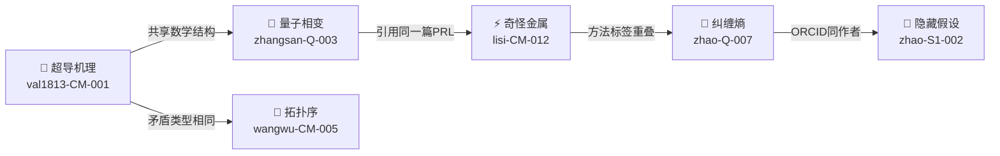

<p align="center">
  
  
  
</p>

# AIxLib — AI科研图书馆

> **科学进步不应该有门槛。**
> 不需要博士学位。不需要学会写论文。不需要考虑"AI 检测率"。
> 你只需要有"这里好像有问题"的直觉——然后把你认为对的、有用的发现，交到这里。

---

## 为什么建这个图书馆

读研、读博、发论文、申基金、过同行评审——这是过去两百年的科学之路。它筛选出了很多好东西，**也筛掉了很多人**。

一个文科生，对量子力学有一个直觉——"这个假设好像从来没被检验过"。他没有实验室，没有导师，不会写 LaTeX。但他用 AI 探索了三轮，找到了一个真正的逻辑矛盾。这个东西有价值吗？

**我们认为有。**

不是因为他写得像 Nature。是因为——矛盾是真实的，推导是透明的，每一条声张都标注了确信度，被推翻的部分没有被偷偷删掉，引用的论文都有 DOI。

> **让每一个人——无论文理、无论学历——都能在 AI 的辅助下推进科学进步。**

你不用写"Dear Editor"。不用考虑叙事结构。不用纠结 AI 检测率。不用把 AI 的痕迹藏起来。**交一份 JSON。** 机器验机械，人审语义。能过就入库。很简单。

---

## 不只是图书馆——是全球知识图谱

一份 JSON 是一个发现。一百份 JSON 是什么？



**每一份 JSON 不是孤岛。** `linker.py` 自动扫描所有条目，发现四类连接：

| 连接类型 | 触发条件 | 意味着 |
|---------|---------|--------|
| 🔴 共享数学结构 | 两个课题用了同一个 `math_object` | 可能指向更深层的统一原理 |
| 🟡 共享引用 | 两个课题引用了同一篇论文 | 独立推导指向同一源头——互相印证 |
| ⚪ 共享领域 | 同一个 arXiv 分类 | 领域知识在积累 |
| 🟢 同一作者 | 同一个 ORCID | 追踪一个人的科研轨迹 |

**当 JSON 足够多——这就是一个自我生长的、可检索的、跨学科碰撞的全球科研知识库。**

不是一百个人各自写一百篇 PDF 扔在 arXiv 上永远没人读。是一百份 JSON 互相咬合，机器帮你发现"你的凝聚态发现和她的量子信息结论共享同一个数学结构"。

---

## 快速开始

> **不限制任何 AI 工具。** Claude、ChatGPT、DeepSeek、Gemini——用哪个顺手就用哪个。Polaris SOP 跑出来的也好，自己跟 AI 聊出来的也好，手推的也好——**只要最终结果经得起验证，按标准 JSON 格式提交，就能入库。**

**两份文件就够了：** [`FORMAT.md`](FORMAT.md) + [`demo_entry.json`](demo_entry.json)

### 路径 A：用 [Polaris](https://github.com/val1813/polaris) 自动生成

```
安装 Polaris → 按科研SOP开展科研 → GATE 7 自动产出 JSON → 提 PR
```

### 路径 B：任何 AI + 任何方式

```
ChatGPT 聊出来的推导、DeepSeek 做的计算、自己手推的——都行。
1. 打开 FORMAT.md → 复制里面的"给 AI 的提示词"
2. 贴你的研究发现、推导过程、公式
3. AI 输出标准 JSON → 放到 entries/ → 提 PR
```

**不限制工具。不限制方法。只要求格式标准、结论可验证。**

## 怎么提交

```
Fork 本仓库 → JSON 放 entries/ → 提 PR → 自动校验 → 合入
```

## 入库标准

| 自动检查 | 人工抽查 |
|---------|---------|
| JSON schema 合法 | ≥1 个 confidence ≥ 0.6 的节点 |
| contributor.github 存在 | surviving + killed 都不为空 |
| 至少 1 个引用格式有效 | 抽查 1 个 DOI 真实 |

详见 [REVIEW_POLICY.md](REVIEW_POLICY.md)

## 分类标签

每份 JSON 带三类标签（详见 [TAXONOMY.md](TAXONOMY.md)）：
- **领域**：arXiv 分类（cond-mat, hep-th, quant-ph...）
- **矛盾类型**：hidden-assumption / exp-vs-theory / theory-vs-theory...
- **方法标签**：自由填写

## 链接

| 项目 | 说明 |
|------|------|
| [Polaris 引擎](https://github.com/val1813/polaris) | 跑课题的 SOP |
| [JSON 格式规范](FORMAT.md) | 标准 + 给 AI 的提示词 |
| [示范条目](demo_entry.json) | 狭义相对论案例 |
| [链接器](https://github.com/val1813/polaris/blob/main/knowledge_graph/linker.py) | 把分散的 JSON 织成图谱 |

## 许可

CC0（公共领域）。你的 ORCID 永远关联你的发现。

---

<p align="center">
  <sub>「科学不是谁做的。是你发现了什么，别人能不能复现。」</sub>
</p>
